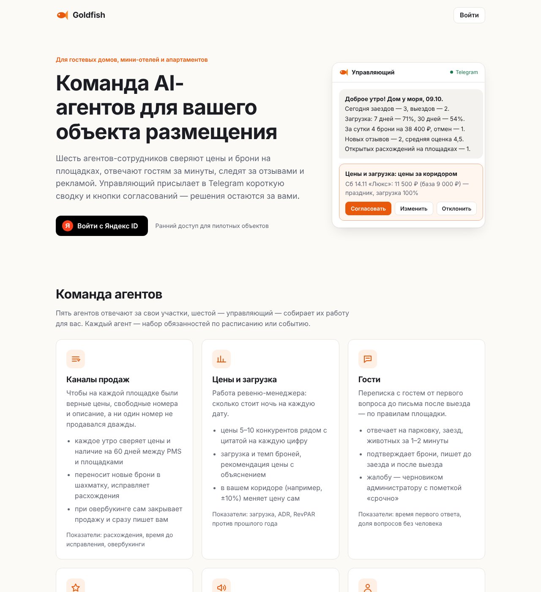
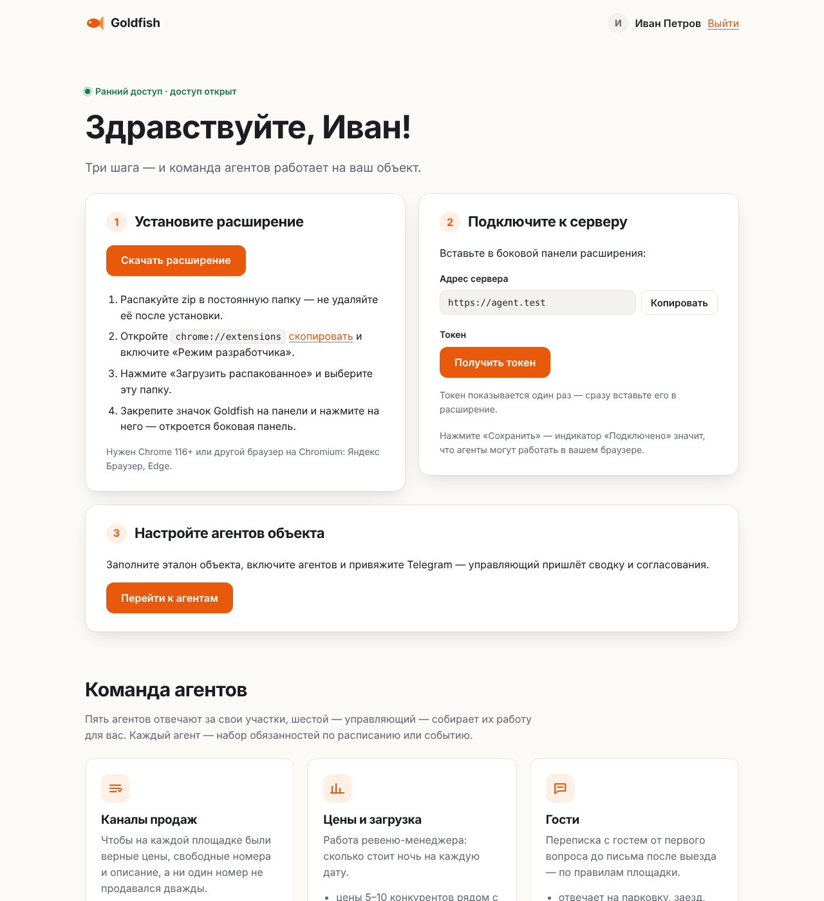

# Goldfish — сайт

Одностраничник Goldfish: коротко о продукте, вход через Яндекс ID, скачивание расширения и выдача
доступа к серверу агента. Позже через этот сайт будут оформляться подписки; сейчас доступ есть у
каждого, кто вошёл.

| Гость                        | После входа                  |
| ---------------------------- | ---------------------------- |
|  |  |

## Как это устроено

```
Пользователь ──► Сайт (этот репозиторий) ──── API оператора ────► Сервер Goldfish
   │  вход через Яндекс ID                    пользователь, токен
   │  скачивает zip, получает токен
   │
   └──► Расширение ──── WebSocket /ws + токен ────► Сервер Goldfish
```

- Сайт хранит своих пользователей (Яндекс ID, имя, e-mail) и сессии в PostgreSQL.
- По кнопке «Получить токен» сайт через API оператора Goldfish заводит пользователя
  `yandex:<id Яндекса>` в клиенте «Сайт» и выпускает токен устройства. Токен показывается один раз и
  на сайте не хранится, только его id; новый токен отзывает предыдущий.
- Расширение работает напрямую с сервером Goldfish: в работе агента сайт не участвует и может быть
  недоступен.
- Zip расширения сайт берёт у сервера Goldfish (`/extension/download`, он есть в его Docker-образе)
  или из своего файла `EXTENSION_ZIP`.

Код сервера и расширения — в репозитории [goldfish](https://github.com/Bulat89/goldfish).

## Подписки — куда подключать

Доступ решает одна функция — `accessOf(user)` в [`src/access.ts`](src/access.ts); сейчас она
пускает всех. Когда появятся тарифы:

1. Добавить в пользователя план и оплаченный период — новой миграцией в
   [`src/store/migrations.ts`](src/store/migrations.ts) (старые миграции не менять).
2. Считать доступ в `accessOf`: без доступа сайт не выдаёт токен и не отдаёт zip, а в кабинете
   показывает причину.
3. При оплате и окончании периода отправлять состояние на сервер Goldfish:
   `POST /admin/users/<clientId>/yandex:<id>/subscription {"action":"activate"|"suspend","until":…}`.
   Сервер сам отключит расширение и остановит задачи, а после продления всё продолжится с того же
   места — диалоги и память сохраняются.

## Приложение Яндекс ID

1. Создайте приложение на [oauth.yandex.ru](https://oauth.yandex.ru/client/new), платформа —
   «Веб-сервисы».
2. Redirect URI: `https://<домен сайта>/auth/yandex/callback`. Для локального запуска добавьте
   `http://localhost:3000/auth/yandex/callback`.
3. Доступы: логин, имя и фамилия (`login:info`), адрес электронной почты (`login:email`), портрет
   (`login:avatar`).
4. ClientID → `YANDEX_CLIENT_ID`, Client secret → `YANDEX_CLIENT_SECRET`.

## Запуск локально

Нужен Node.js 22 и запущенный сервер Goldfish (его README, раздел «Быстрый старт»).

```bash
npm ci
PUBLIC_URL=http://localhost:3000 \
YANDEX_CLIENT_ID=… YANDEX_CLIENT_SECRET=… \
GOLDFISH_URL=http://localhost:8080 GOLDFISH_ADMIN_TOKEN=<ADMIN_TOKEN сервера Goldfish> \
npm run dev
```

Без `DATABASE_URL` пользователи и сессии живут в памяти и пропадают при перезапуске.

## Развёртывание в Timeweb Cloud

### Вариант А — App Platform, Docker Compose

1. App Platform → новое приложение из этого репозитория, тип «Docker Compose»
   (`docker-compose.yml` в корне). Сайт слушает порт `3000`, проверка состояния — `/healthz`.
2. В разделе переменных приложения задайте: `PUBLIC_URL`, `YANDEX_CLIENT_ID`,
   `YANDEX_CLIENT_SECRET`, `GOLDFISH_URL`, `GOLDFISH_ADMIN_TOKEN` (остальные — по желанию, список
   ниже). Compose подставляет их в контейнер сам — файл `.env` в репозитории не нужен и не должен
   там лежать.
3. База: без `DATABASE_URL` сайт использует PostgreSQL из того же compose. Надёжнее управляемая база
   Timeweb (резервные копии, переживает пересборку) — тогда задайте её строку в `DATABASE_URL`.
   Таблицы сайт создаёт сам при старте.
4. Привяжите домен. `PUBLIC_URL` — этот адрес с `https://`, он же в Redirect URI приложения Яндекс ID.

Если сайт не стартует, в логах приложения будет `Invalid configuration` со списком незаданных
переменных.

### Вариант Б — App Platform, Dockerfile

То же, но тип «Dockerfile» (порт `3000`, `/healthz`): контейнер только с сайтом, база — управляемая
PostgreSQL 16 в `DATABASE_URL` (обязательна), плюс `NODE_ENV=production`.

### Вариант В — облачный сервер с Docker

```bash
git clone https://github.com/Bulat89/site_ai_agent.git && cd site_ai_agent
cp .env.example .env     # заполнить: PUBLIC_URL, YANDEX_*, GOLDFISH_*, SITE_DOMAIN
docker compose -f docker-compose.yml -f deploy/caddy.yml up -d   # + Caddy с сертификатом Let's Encrypt
```

- A-запись домена (`SITE_DOMAIN`) — на IP сервера, порты 80 и 443 открыты. С Caddy сайт слушает
  только `127.0.0.1:3000`.
- Уже есть nginx или другой прокси с TLS — просто `docker compose up -d` и проксируйте на порт
  `3000`; закройте этот порт снаружи файрволом.
- Обновление: `git pull && docker compose up -d --build`.
- Резервная копия: `docker compose exec postgres pg_dump -U site site > site.sql`.

### Связь с сервером Goldfish

- `GOLDFISH_ADMIN_TOKEN` — это `ADMIN_TOKEN` сервера Goldfish, он даёт полный доступ к серверу:
  храните его как пароль. Если `/admin` закрыт от интернета (так советует документация Goldfish),
  разрешите адрес сайта или укажите внутренний адрес в `GOLDFISH_ADMIN_URL`.
- Пользователи сайта видны в панели оператора Goldfish (`/admin/ui`) в клиенте «Сайт» — с именем и
  e-mail. Лимиты и подписку пока можно менять там.
- `/extension/download` на сервере Goldfish открыт без входа. Чтобы zip был доступен только после
  регистрации, закройте этот путь на прокси Goldfish и положите zip на сайт (`EXTENSION_ZIP`).

## Переменные окружения

Сайт читает настройки из окружения. В App Platform их задают в разделе переменных приложения, на
своём сервере docker compose подставляет их из `.env` рядом с `docker-compose.yml` (шаблон —
[`.env.example`](.env.example)). Пустое значение (`KEY=`) означает «не задано». Неверное значение
или недостающая обязательная переменная останавливают запуск с ошибкой.

В колонке «Обязательна»: **да** — без неё сайт не запустится; **да, если …** — обязательна при
условии; **нет** — есть значение по умолчанию или возможность просто выключена.

### Сайт

| Переменная     | Обязательна                    | По умолчанию  | Описание                                                                                                                                                                 |
| -------------- | ------------------------------ | ------------- | ------------------------------------------------------------------------------------------------------------------------------------------------------------------------ |
| `NODE_ENV`     | нет                            | `development` | `development`, `production` или `test`; в Docker-образе и в docker compose — `production`                                                                                |
| `HOST`         | нет                            | `0.0.0.0`     | адрес, на котором слушает сайт                                                                                                                                           |
| `PORT`         | нет                            | `3000`        | порт HTTP                                                                                                                                                                |
| `LOG_LEVEL`    | нет                            | `info`        | `fatal`, `error`, `warn`, `info`, `debug`, `trace`, `silent`                                                                                                             |
| `PUBLIC_URL`   | да                             | —             | адрес сайта, как его открывают пользователи. Из него строится Redirect URI `<PUBLIC_URL>/auth/yandex/callback`; по `https` включаются защищённые cookie                  |
| `DATABASE_URL` | да, если `NODE_ENV=production` | — (в памяти)  | PostgreSQL: пользователи и сессии. Таблицы создаются при старте. В docker compose по умолчанию — база из того же compose; для управляемой базы Timeweb задайте её строку |
| `SESSION_DAYS` | нет                            | `30`          | сколько дней действует вход на сайт (1–365)                                                                                                                              |

### Яндекс ID

| Переменная             | Обязательна | По умолчанию              | Описание                                          |
| ---------------------- | ----------- | ------------------------- | ------------------------------------------------- |
| `YANDEX_CLIENT_ID`     | да          | —                         | ClientID приложения Яндекс ID                     |
| `YANDEX_CLIENT_SECRET` | да          | —                         | Client secret приложения Яндекс ID                |
| `YANDEX_OAUTH_URL`     | нет         | `https://oauth.yandex.ru` | адрес OAuth Яндекса; менять только в тестах       |
| `YANDEX_LOGIN_URL`     | нет         | `https://login.yandex.ru` | адрес API профиля Яндекса; менять только в тестах |

### Сервер Goldfish

| Переменная             | Обязательна | По умолчанию   | Описание                                                                                                           |
| ---------------------- | ----------- | -------------- | ------------------------------------------------------------------------------------------------------------------ |
| `GOLDFISH_URL`         | да          | —              | сервер Goldfish, как его вводят в расширении (адрес видит пользователь)                                            |
| `GOLDFISH_ADMIN_URL`   | нет         | `GOLDFISH_URL` | адрес API оператора, если сайт ходит к серверу не через `GOLDFISH_URL` (например, по внутреннему адресу)           |
| `GOLDFISH_ADMIN_TOKEN` | да          | —              | `ADMIN_TOKEN` сервера Goldfish, не короче 16 символов. Даёт полный доступ к серверу — храните как пароль           |
| `GOLDFISH_CLIENT_ID`   | нет         | —              | клиент (компания) Goldfish для пользователей сайта; без него клиент ищется по `GOLDFISH_CLIENT_NAME` или создаётся |
| `GOLDFISH_CLIENT_NAME` | нет         | `Сайт`         | имя клиента Goldfish, если `GOLDFISH_CLIENT_ID` не задан                                                           |

### Расширение и подвал

| Переменная      | Обязательна                   | По умолчанию | Описание                                                                                                    |
| --------------- | ----------------------------- | ------------ | ----------------------------------------------------------------------------------------------------------- |
| `EXTENSION_ZIP` | нет                           | —            | путь к своему zip расширения; без него (или если файла нет) zip берётся с `GOLDFISH_URL/extension/download` |
| `PRIVACY_URL`   | нет (по 152-ФЗ лучше указать) | —            | политика обработки персональных данных, ссылка в подвале                                                    |
| `SUPPORT_EMAIL` | нет                           | —            | адрес поддержки, ссылка в подвале                                                                           |

### docker compose

| Переменная    | Обязательна                   | По умолчанию | Описание                                                                                                |
| ------------- | ----------------------------- | ------------ | ------------------------------------------------------------------------------------------------------- |
| `SITE_DOMAIN` | да, если с `deploy/caddy.yml` | —            | домен сайта, для которого Caddy получает сертификат Let's Encrypt; читает `deploy/caddy.yml`, а не сайт |

Compose передаёт в контейнер только переменные из списка `environment` в `docker-compose.yml`:
`HOST` и `PORT` там не задаются — сайт всегда слушает `0.0.0.0:3000`.

### Тесты

| Переменная          | Обязательна | Описание                                                   |
| ------------------- | ----------- | ---------------------------------------------------------- |
| `TEST_DATABASE_URL` | нет         | `npm test` дополнительно проверяет хранилище на PostgreSQL |

## Маршруты

| Метод | Путь                    |                                                       |
| ----- | ----------------------- | ----------------------------------------------------- |
| GET   | `/`                     | лендинг для гостя, кабинет после входа                |
| GET   | `/auth/yandex`          | переход на Яндекс ID                                  |
| GET   | `/auth/yandex/callback` | возврат с Яндекс ID, начало сессии                    |
| POST  | `/logout`               | выход                                                 |
| GET   | `/download`             | zip расширения (только после входа)                   |
| POST  | `/api/token`            | новый токен устройства `{token, serverUrl, issuedAt}` |
| GET   | `/healthz`, `/readyz`   | живость и готовность (с проверкой базы)               |

## Безопасность

- Вход — authorization code с PKCE и `state`. Токен Яндекса используется один раз, чтобы прочитать
  профиль, и не сохраняется.
- Cookie — `HttpOnly`, `SameSite=Lax`, по `https` с префиксом `__Host-` (поддомен не подложит свою
  сессию). Сессии хранятся в базе хешем.
- Изменяющие запросы (`/api/token`, `/logout`) принимаются только со страниц самого сайта (проверка
  `Origin`); CSP без inline-скриптов, страница не встраивается во фреймы.
- Персональные данные (имя, e-mail) хранятся в PostgreSQL — держите базу в России (152-ФЗ) и укажите
  `PRIVACY_URL`.
- Выдача токенов сериализуется в памяти процесса — запускайте одну реплику.

## Проверки

```bash
npm run typecheck
npm test                                                     # Яндекс ID и сервер Goldfish — фейковые
TEST_DATABASE_URL=postgres://… npm test                      # + хранилище на PostgreSQL
npm run format:check
```
